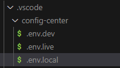
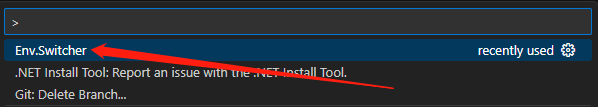
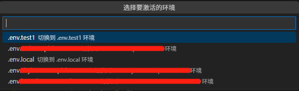
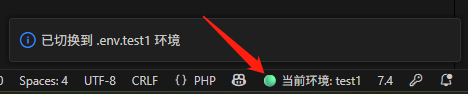

# .ENV switcher

1, Install extension.  
2, Create ".env" for each environment named as follow under folder .vscode. 

  
3, Choose Env.Switcher. 

  
4, Choose env. 

  
5, Display current environment. 

