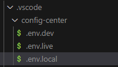
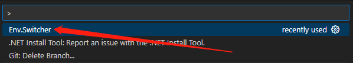
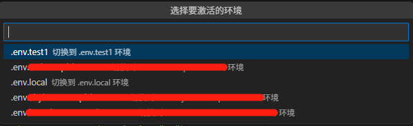
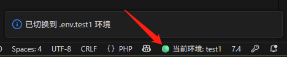

# env switcher

1, Install extension. 
2, Create ".env" for each environment named as follow under folder .vscode.

 
3, Choose Env.Switcher. 

 
4, Choose env. 

 
5, Display current environment. 

